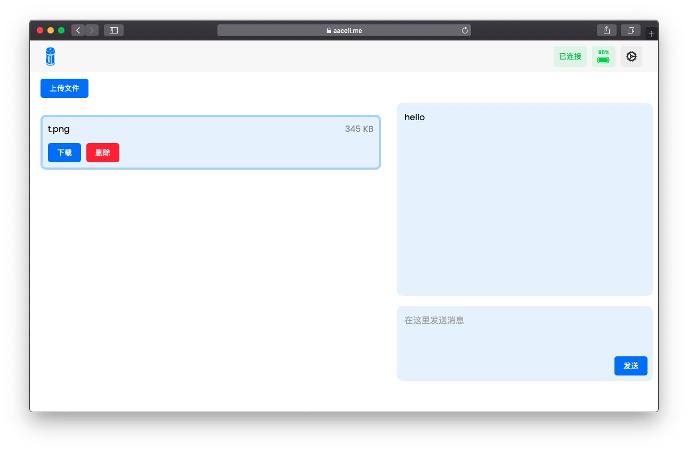

# 1.0.0

- New features
  - :house:Users can create a room.
  - :page_with_curl: Transfer files in a specific room with everybody everywhere, only if you have the web Browser.
  - :spiral_notepad: Send messages in the room.
  
- Interface

小室「hello」的 Chrome 浏览效果

小室「hello」的 Safari 浏览效果

