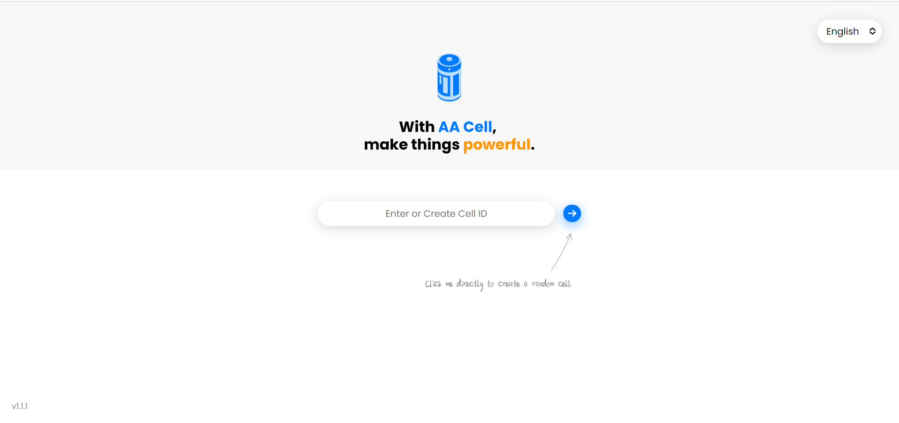
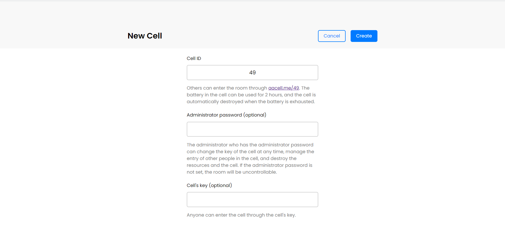
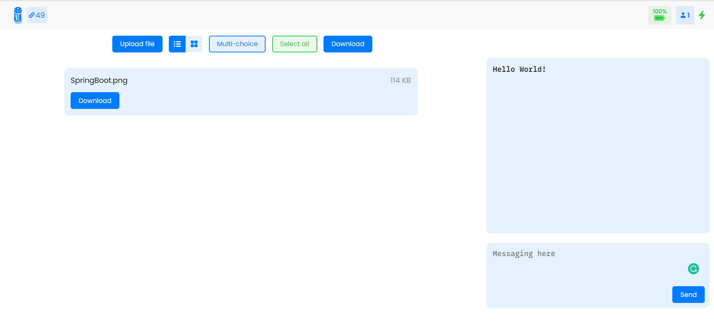

# 1.1.0

- 新增：
  - 创建房间页面点击创建按钮后变为「创建中...」
  - 上传文件的进度
  - 文件大小超限提示
  - 添加房间人数显示，连接状态变为图标
  - 随机房间从 2 位开始
  - 添加房间 ID 链接显示
  - 添加文件显示布局按钮
  - 手动断开连接或当房间过期后，房间会弹窗提示
  - 繁体中文 支持

- 修复：
  - 无密码房间强制进入 settings 页面会自动跳转
  - 「上传文件」按钮的本地化
  - 解决文件下载文件名中文变__问题
  - 解决 textbox 标题溢出问题
  - 解决文件名特殊字符乱码问题

- New feature:
  - Add upload file progress bar.
  - :family_man_woman_girl_boy: Statistics for the socket links' number, change the members' count in time.
  - :x: Add 'delete multi files' function.
  - :link: Add a button can get the room's link.
  - Change the font style.
  - Add 'select all' function.

- Solved:
  - :bug: Fix some bugs.
  - :file_folder: Solve the file name encode and decode problem, with Base64.
  - Update UI

## Interface

