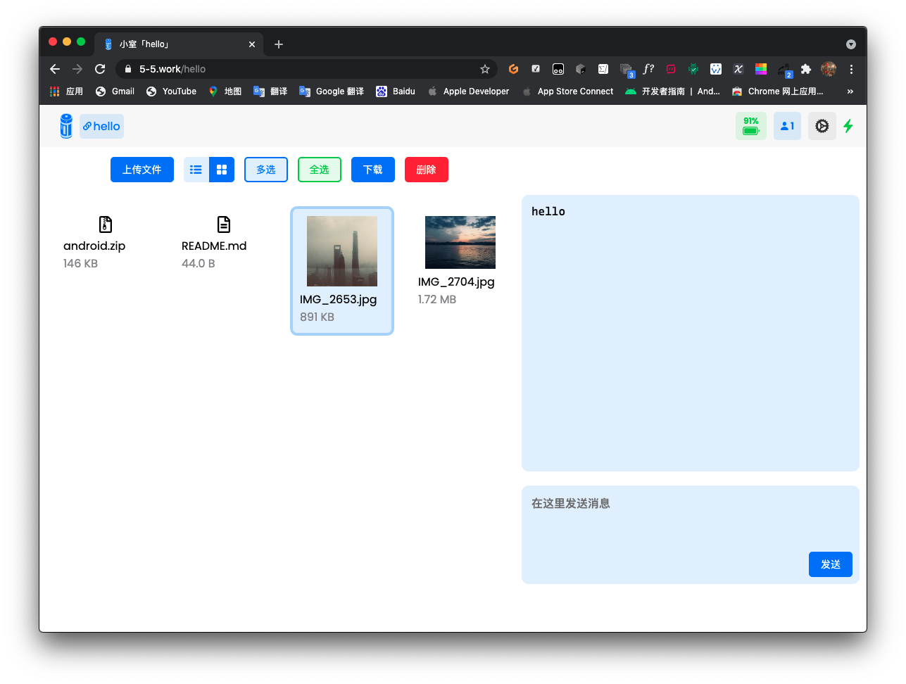

# 1.2.0

- 新增
  - 小室管理者可删除消息，消息使用 Base64 编码并存入数据库
  - 文件可一次性上传多个
  - 文件类型图标和文件缩略图
  - 按 Ctrl/Control + Enter 可发送消息
  - 可以粘贴图片以上传图片
  - 小室二维码和链接
- 优化
  - 设定 grid 布局最大宽度
  - 小室人数统计逻辑
  - 批量删除文件的对话框改为显示文件个数
  - 缩减 recursive 字体大小
  - textbox 确认按钮在有网络服务时会变成「请稍候...」
  - textbox 取消按钮变成「X」
  - textbox UI 优化
  - 单选文件时，点击文件列表空白处可取消选择
  - 信息界面横屏适配
- 修复
  - 解决单个消息 UI 有时会出现滚动条的问题
  - 解决批量删除文件可能会错误统计个数的问题
  - 解决拖动文件途中，拖到文字上时会中断拖动事件的问题
  - 解决小室 ID 有大小写区分时可能无法正常发送消息的问题
  - 解决部分文字未完全本地化的问题
  - 解决在 textbox 弹出时呼出文件拖动 UI 无法恢复的问题

New website : [https://5-5.work](https://5-5.work)

New feature：

- Show snapshot for the picture.

- HTTPS support.
- Can share the room with others by the room's QR code.

- Can delete the message when has administered the password.
- Can choose multi-file to update.

Update:

- Front-end animation.
- Front-end UI.

textbox:

<figure class="video_container">
  <video controls="true" allowfullscreen="true">
    <source src="1.mov" type="video/mov">
  </video>
</figure>

